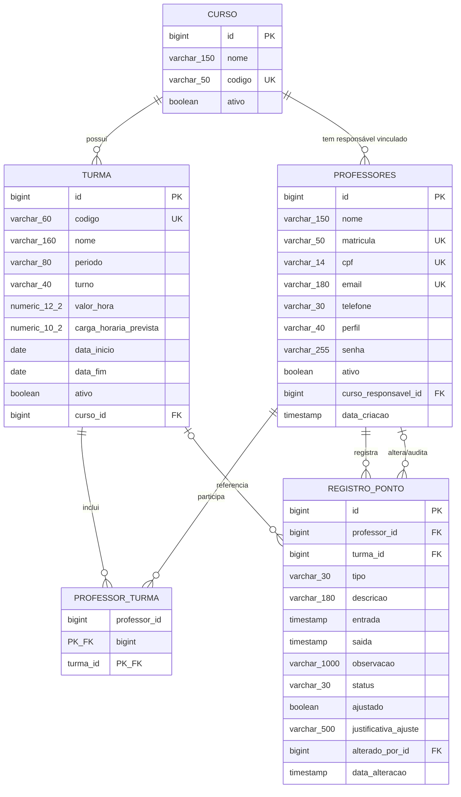

# Modelagem do banco de dados — HoraControl

Este documento representa o esquema atualmente definido pela migration Flyway
`V1__estrutura_horacontrol.sql` e pelas entidades JPA do sistema.

## Visão geral

O banco utiliza PostgreSQL e possui cinco tabelas:

| Tabela | Finalidade |
|---|---|
| `curso` | Cadastro dos cursos da instituição. |
| `professores` | Contas autenticadas, incluindo professores, coordenadores e administradores. |
| `turma` | Turmas nas quais são realizadas as aulas. |
| `professor_turma` | Associação N:N entre professores e turmas. |
| `registro_ponto` | Entradas, saídas e ajustes dos registros de ponto. |

## Diagrama entidade-relacionamento

> No diagrama, `UK` indica unicidade. Os campos opcionais aparecem detalhados
> nas tabelas abaixo.

## Dicionário de dados

### `curso`

| Coluna | Tipo | Obrigatória | Regra |
|---|---|---:|---|
| `id` | `bigserial` | Sim | Chave primária. |
| `nome` | `varchar(150)` | Sim | Nome do curso. |
| `codigo` | `varchar(50)` | Não | Único quando preenchido. |
| `ativo` | `boolean` | Sim | Padrão `true`; suporta exclusão lógica. |

### `professores`

Esta tabela representa todos os usuários do sistema, não apenas professores.

| Coluna | Tipo | Obrigatória | Regra |
|---|---|---:|---|
| `id` | `bigserial` | Sim | Chave primária. |
| `nome` | `varchar(150)` | Sim | Nome do usuário. |
| `matricula` | `varchar(50)` | Não | Única quando preenchida. |
| `cpf` | `varchar(14)` | Não | Único quando preenchido. |
| `email` | `varchar(180)` | Sim | Único sem diferenciar maiúsculas/minúsculas. |
| `telefone` | `varchar(30)` | Não | Contato do usuário. |
| `perfil` | `varchar(40)` | Sim | Padrão `PROFESSOR`. |
| `senha` | `varchar(255)` | Sim | Hash BCrypt usado na autenticação. |
| `ativo` | `boolean` | Sim | Padrão `true`; suporta exclusão lógica. |
| `curso_responsavel_id` | `bigint` | Não | FK para `curso.id`, usada pelo coordenador de curso. |
| `data_criacao` | `timestamp` | Sim | Data/hora de criação da conta. |

Valores de `perfil` previstos pela aplicação: `PROFESSOR`,
`COORDENADOR_CURSO`, `COORDENADOR_NUCLEO`, `COORDENADOR_EIXO` e `ADMIN`.

### `turma`

| Coluna | Tipo | Obrigatória | Regra |
|---|---|---:|---|
| `id` | `bigserial` | Sim | Chave primária. |
| `codigo` | `varchar(60)` | Não no banco | Único sem diferenciar maiúsculas/minúsculas; a entidade Java o exige. |
| `nome` | `varchar(160)` | Sim | Nome da turma. |
| `periodo` | `varchar(80)` | Não | Período acadêmico. |
| `turno` | `varchar(40)` | Não | Turno da turma. |
| `valor_hora` | `numeric(12,2)` | Sim | Padrão `0`; usado no cálculo financeiro. |
| `carga_horaria_prevista` | `numeric(10,2)` | Não | Total de horas planejadas. |
| `data_inicio` | `date` | Não | Início da turma. |
| `data_fim` | `date` | Não | Término da turma. |
| `ativo` | `boolean` | Sim | Padrão `true`; suporta exclusão lógica. |
| `curso_id` | `bigint` | Não | FK para `curso.id`. |

### `professor_turma`

| Coluna | Tipo | Obrigatória | Regra |
|---|---|---:|---|
| `professor_id` | `bigint` | Sim | PK composta e FK para `professores.id`. |
| `turma_id` | `bigint` | Sim | PK composta e FK para `turma.id`. |

Os vínculos são apagados em cascata se o professor ou a turma forem apagados
fisicamente. No fluxo normal, a aplicação apenas inativa esses cadastros.

### `registro_ponto`

| Coluna | Tipo | Obrigatória | Regra |
|---|---|---:|---|
| `id` | `bigserial` | Sim | Chave primária. |
| `professor_id` | `bigint` | Sim | FK para quem registrou o ponto. |
| `turma_id` | `bigint` | Não | FK para a turma; pode ficar vazio em atividade extra. |
| `tipo` | `varchar(30)` | Sim | `AULA_NORMAL` ou `ATIVIDADE_EXTRA`. |
| `descricao` | `varchar(180)` | Não | Descrição da atividade. |
| `entrada` | `timestamp` | Sim | Início do período trabalhado. |
| `saida` | `timestamp` | Não | Fim do período; vazio enquanto o ponto está aberto. |
| `observacao` | `varchar(1000)` | Não | Observações gerais. |
| `status` | `varchar(30)` | Sim | `ABERTO` ou `FECHADO`. |
| `ajustado` | `boolean` | Sim | Indica ajuste administrativo. |
| `justificativa_ajuste` | `varchar(500)` | Não | Motivo do ajuste. |
| `alterado_por_id` | `bigint` | Não | FK para o usuário que realizou o ajuste. |
| `data_alteracao` | `timestamp` | Não | Data/hora do último ajuste. |

## Relacionamentos e cardinalidades

1. Um `curso` pode possuir zero ou várias `turma`; cada turma pertence a zero
   ou um curso no esquema atual.
2. Um `curso` pode estar associado a vários coordenadores; cada usuário possui
   no máximo um curso de responsabilidade.
3. Um `professor` pode atuar em várias turmas e uma `turma` pode ter vários
   professores, por meio de `professor_turma`.
4. Um `professor` pode possuir vários registros de ponto; todo registro possui
   exatamente um professor.
5. Uma `turma` pode aparecer em vários registros; o vínculo no registro é
   opcional para permitir atividades extras.
6. Um usuário pode alterar vários registros; `alterado_por_id` preserva quem
   realizou o último ajuste.

## Índices existentes

| Índice | Uso |
|---|---|
| `uk_curso_codigo` | Unicidade de código de curso quando não nulo. |
| `uk_professor_email` | Unicidade de e-mail com `lower(email)`. |
| `uk_professor_matricula` | Unicidade de matrícula quando não nula. |
| `uk_professor_cpf` | Unicidade de CPF quando não nulo. |
| `uk_turma_codigo` | Unicidade de código de turma com `lower(codigo)`. |
| `idx_registro_professor_entrada` | Histórico de um professor por entrada. |
| `idx_registro_turma_entrada` | Registros de uma turma por entrada. |
| `uk_registro_ponto_aberto_professor` | Garante no banco apenas um ponto aberto por professor. |

A chave primária de `professor_turma (professor_id, turma_id)` também cria um
índice útil para consultas iniciadas por `professor_id`.

## Avaliação da modelagem atual

### Pontos positivos

- As entidades principais estão separadas e sem duplicação relevante.
- A relação N:N entre professores e turmas foi corretamente normalizada.
- Valores financeiros usam `numeric`, evitando erros de ponto flutuante.
- A unicidade de um ponto aberto por professor está protegida por índice parcial,
  evitando condição de corrida entre requisições.
- Exclusão lógica de cursos, turmas e usuários preserva o histórico.
- E-mail e códigos de turma são comparados sem diferença entre letras maiúsculas
  e minúsculas.
- As consultas mais frequentes de ponto por professor e turma possuem índices
  compostos adequados.

### Pontos que merecem ajuste

1. **Divergência no código da turma:** o Java define `codigo` como obrigatório,
   mas a migration permite `NULL`. O banco deve receber `NOT NULL` após corrigir
   eventuais dados antigos.
2. **Domínios sem `CHECK`:** `perfil`, `tipo` e `status` aceitam qualquer texto
   diretamente no PostgreSQL. Restrições `CHECK` manteriam os dados compatíveis
   com os enums Java.
3. **Regras temporais sem proteção no banco:** faltam validações para
   `data_fim >= data_inicio` e `saida >= entrada`.
4. **Valores negativos:** `valor_hora` e `carga_horaria_prevista` não possuem
   restrições que impeçam números negativos.
5. **Coerência do ponto:** o banco não garante que ponto `ABERTO` tenha saída
   nula, que ponto `FECHADO` tenha saída preenchida ou que `AULA_NORMAL` possua
   uma turma.
6. **Índices de FKs ausentes:** convém indexar `professores.curso_responsavel_id`,
   `turma.curso_id`, `registro_ponto.alterado_por_id` e
   `professor_turma.turma_id`. O PostgreSQL não cria índices automaticamente para
   chaves estrangeiras.
7. **Consultas globais por data:** existe consulta por intervalo de `entrada`,
   mas nenhum índice iniciado somente por `entrada`; os índices atuais começam
   por professor ou turma.
8. **Datas sem fuso:** os campos usam `timestamp without time zone`. Se houver
   operação em diferentes fusos ou servidores, `timestamptz` é mais seguro.
9. **Auditoria limitada:** o registro guarda apenas o último ajuste. Se for
   necessário histórico completo, recomenda-se uma tabela
   `registro_ponto_auditoria` com uma linha por alteração.
10. **Nome da tabela de usuários:** `professores` contém também administradores e
    coordenadores. Funciona tecnicamente, mas `usuarios` expressaria melhor o
    domínio em uma futura versão.

## Prioridade recomendada

| Prioridade | Melhoria | Motivo |
|---:|---|---|
| Alta | Alinhar `turma.codigo` como `NOT NULL`. | Remove divergência entre JPA e banco. |
| Alta | Criar restrições `CHECK` de enums, datas, valores e estado do ponto. | Protege integridade mesmo fora da aplicação. |
| Alta | Adicionar índices nas FKs e em `registro_ponto(entrada DESC)`. | Evita varreduras conforme o volume crescer. |
| Média | Migrar timestamps para `timestamptz`. | Torna datas inequívocas. |
| Média | Criar auditoria completa de ajustes. | Melhora rastreabilidade trabalhista e administrativa. |
| Baixa | Renomear `professores` para `usuarios`. | Melhora clareza, mas exige migração e ajustes no código. |

## Conclusão

A modelagem atual atende bem um sistema acadêmico de controle de ponto de
pequeno ou médio porte. Ela está normalizada e protege corretamente sua regra de
concorrência mais importante: somente um ponto aberto por professor. A principal
evolução necessária é transferir para o PostgreSQL algumas regras que hoje estão
protegidas apenas pelos services Java, além de completar os índices das chaves
estrangeiras e dos relatórios por período.
